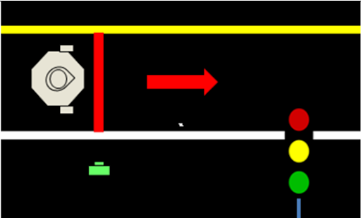

# Auto_Race_TurtleBot3
<code>sudo apt update</code>
<pre>sudo apt install</pre>
- sejfs

```bash
  roslaunch detect detect_lane.launch
  roslaunch {pkg_name} {launch_file_name.launch}
  # Launch detect_lane.py 
```

