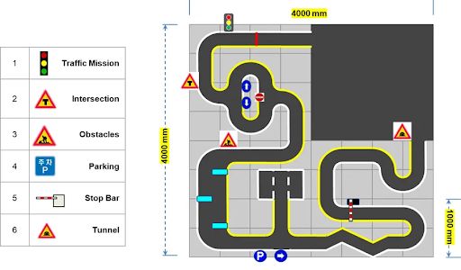
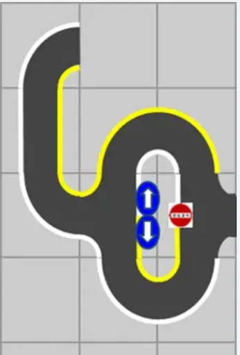
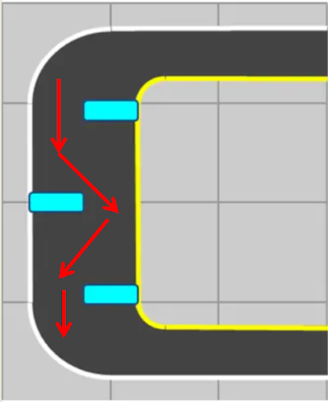
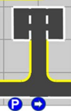
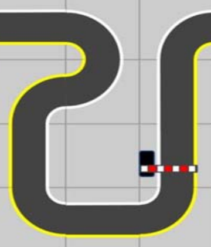
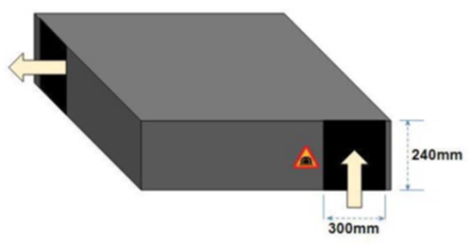
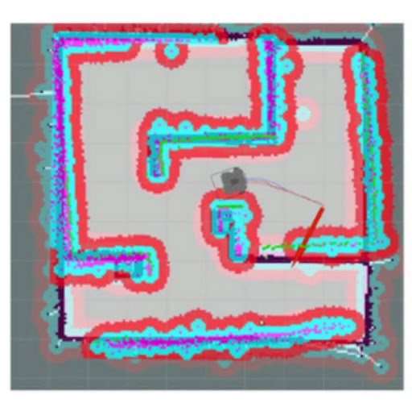
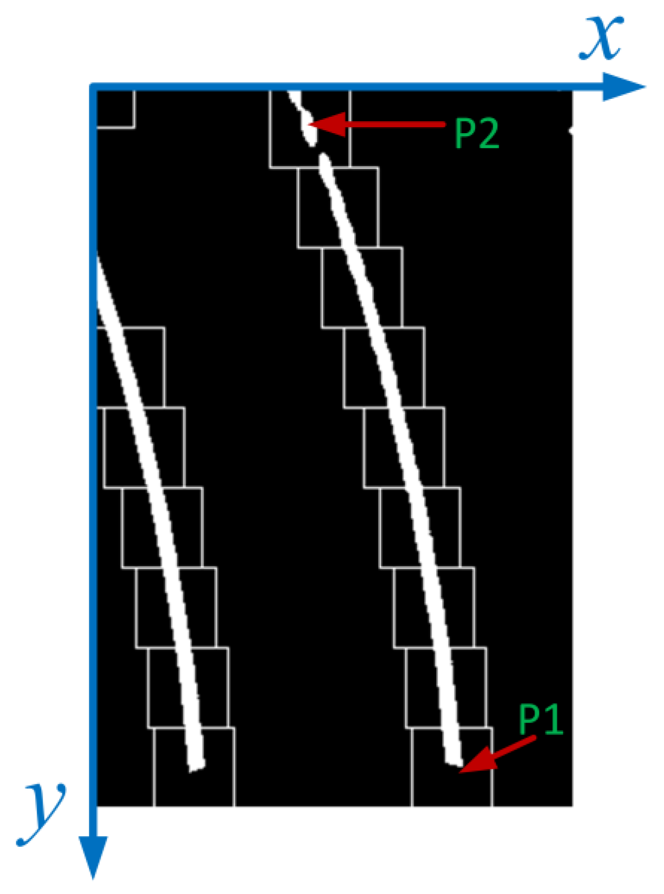
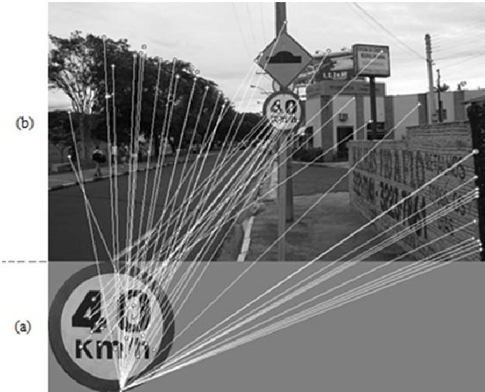
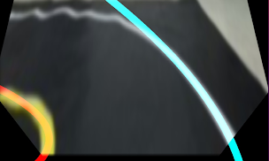

# Auto_Race_TurtleBot3

## Research Objectives

>The primary objective of this project is to develop a Turtlebot3 capable of autonomously navigating and completing a 4 m × 4 m Auto Race course, in which 30 cm-wide lanes are elevated 1–2 cm from the ground and bounded by a white right line and a yellow left line in under five minutes by accomplishing the following six missions:



1. Traffic Light Identification:   
 Detect and classify traffic light colors. Proceed only on green, and remain stationary on red or yellow.


2. Intersection Handling:  
 Recognize the intersection sign and execute the correct turn (left or right) based on randomly positioned directional signs.


3. Obstacle Avoidance:  
 Navigate around three fixed obstacles (20(L)x6(W)x32(H) cm) placed on the course.


4. Parking Maneuvering:  
 Detect the parking sign and identify the occupied space. Park in a vacant space, and remain stationary for at least one second.
5. Stop-Bar Compliance:  
 Stop at least 60 mm in front of the stop bar and resume once it is lifted.


6. Tunnel Navigation:  
 Navigate the unlit tunnel (300 × 240 m entrance/exit), avoid five randomly placed obstacles, and exit to the finish line.

## For each task, we have specific control

1. Traffic Lights:  
Convert the camera image to HSV and apply color thresholds to isolate green, yellow, and red.
- If green is detected, activate the lane-detection and control nodes to follow both lane lines and proceed forward.
- If yellow or red is detected, stop and wait until the light turns green.
  
     <p align="center">
  
</p>

2. Intersection:  
 Detect the intersection sign, with SIFT detection, to initiate the intersection routine. Upon detecting the intersection sign, stop after reaching the left and right signs briefly to identify which directional sign.
- If a left sign is detected, switch to the yellow (left) lane detection only and execute a left turn to give the robot a head start.
- If a right sign is detected, switch to the white (right) lane detection only and execute a right turn to ensure the robot goes the right way.
  - After finishing the half circle, add an additional right turn control to help the robot make a sharp angle turn.
  
  This task combines sign detection with concurrent lane detection, ensuring reliable direction identification by pausing before the sign.

   <p align="center">
  
</p>

3. Construction:  
 Continuously process LiDAR scans to detect obstacles after being activated by detecting the construction sign with SIFT.
- When an obstacle is detected within a predefined distance threshold, trigger the avoidance routine (Fixed control).
- Execute precomputed control maneuvers, tuned through iterative testing, to navigate around the obstacle via the most efficient detour.
  - The route is shown in the figure below, the diagonal path could decrease the number of turns and forward commands.
- Once the obstacle is cleared, realign with the lane and resume forward motion.
  
 
  <p align="center">
  
</p>


4. Parking:  
- After detecting the parking sign with SIFT, the parking process would begin.
  - The yellow (left) lane detection only would be used to turn into the parking site.
- Use LiDAR to scan left and right parking spots and determine which side is vacant.
- Follow the lane lines while entering the parking area.
  - In this case, because there are two yellow lanes, we masked the right side of the input image to avoid confusion while using the same lane detection program.
- Execute a fixed-control maneuver (predefined motion sequence) to maneuver into the selected parking spot and stop for at least one second.
  - Since our design of the robot includes a fan on the back side, there is a balance issue that we have to deal with when moving backward.
    - The solution is to decrease the movement speed when moving backward.

<p align="center">
  
</p>

5. Level Crossing:  
In this task, the robot should stop before the white-and-red level crossing bar.
- Use color detection to isolate the red sections of the white-and-red crossing bar.
- Compute the gap between the leftmost and rightmost red squares to estimate the bar’s distance.
- Slow down as the gap falls below a threshold, and stop before the bar.
- Keep lane detection active; only reduce the robot’s maximum speed while the bar is down.
- Once the bar is lifted, restore the original max speed and continue following the lane.
<p align="center">
  
</p>

6. Tunnel:  
- Inside the tunnel, camera-based lane detection is disabled due to a lack of visible lanes. It relies solely on LiDAR and a path planner.
  - Use AMCL for localization and pathfinding on a pre-recorded map; the map must be generated before competition starts.
- Costmap adjustment
  - Configure a larger inflation radius for the global planner so obstacles appear effectively “bigger,” ensuring the planned path maintains a safety buffer.
  - Configure a smaller inflation radius for local obstacle avoidance so the robot can still navigate past obstacles without overestimating their size.
- Continuously fuse LiDAR data with AMCL’s pose estimate to follow the planned path and avoid the five randomly placed obstacles, exiting the tunnel toward the finish line.

<p align="center">
  
</p>
<p align="center">
  
</p>

## Algorithm Detail

1. Lane Detection (Sliding-Window)
   
<p align="center">
  
</p>

- Histogram  
  - Compute a histogram of pixel intensities in the bottom half of the binary (thresholded) image.
  - Identify the peaks in the histogram corresponding to the strongest responses for the white (right) and yellow (left) lane lines. These peaks mark the initial x-coordinates where each lane line begins.


- Initialize Sliding Windows
  - Divide the binary image vertically into N equally spaced horizontal layers (windows).
  - Center the lowest window of each lane line at its base position (from the histogram).


- Iterative Window Search  
 For each layer, moving upward:
  - Pixel Extraction:   
    - Collect all non-zero (white) pixels within the current window.

  - Recenter Window:  
    - If the number of detected pixels exceeds a predefined threshold, compute their mean x-position and shift the next (upper) window horizontally to center on this mean—thus tracing the lane’s curvature.
    - If too few pixels are found, leave the next window at the same x-position to maintain stability in low-visibility regions.

- Curve Fitting  
  - After processing all layers, aggregate the pixel coordinates for each lane line.
  - Fit a second-order polynomial (quadratic) to these points, yielding a smooth representation of the lane’s curve.

- Visualization & Validation  
  - Overlay the detected windows and fitted curves onto the original image to verify accuracy.
  - The initial histogram peaks visually correspond to the starting positions of the white and yellow lanes, as seen by the high spikes at the bottom of the image.


2. PID  
- PID is a widely used control law that stabilizes the movement of a robot
- Adjust the PID gain
  - PID:
    - Kp is the Proportional gain
    - Ki is the Integral gain
    - Kd is the Derivative gain
  - The three components would add up to control the output of a system response to the error.

- Proportional Gain
  - Proportional control works based on the current error
    - Which, in this case, is the expected (ideal) middle x position and the current (actual) x position.
  - If the robot is currently too close to the right or left 
    - The proportional gain would adjust the robot’s angular value.
  - This is a more aggressive controller to react to the error.
    - If the Kp is adjusted too high, the robot could easily overshoot, which means to over-adjust.
    - In this case, we need Ki and Kd to prevent overshooting and reach a steady state.

- Integral Gain
  - The integral component addresses the steady-state error.
  - It reacts to the overall sum of the error.
    - Which means the sum of the past errors over time.
  - To give an example:
    - If the robot is constantly slightly tilted to the right side, the Ki would react to it and adjust the robot from right back to the middle.
  - Integral gain gives the robot or system a steady-state
- Derivative Gain  
  - Derivative gain reacts to the change in the error.
  - In this case, it is calculated with the change of the current error.
    - Or in other words, it is responding to how fast the error is changing rather than just the error itself.
  - By applying this controller, the robot could prevent overshooting the target point.
    - Also, avoiding rapid angular change that might jeopardize the lane detection or movement control, and providing a smooth control.

    $u(t)=K_{p}e(t)+K_i\int^t_0e(t)dt+K_d\frac{de(t)}{dt}$

- In our program:  
    - Our Kp is adjusted gradually to find the most suitable when met with a turn or zig-zag like lanes.
      - The outcome of the PID controller is to find the right angle, which controls the turn of the robot.
      - We found out that if the robot is moving faster, our Kp needs to increase as well as our Kd, due to the reaction time of the robot is greatly decreased.
  - Once our Kp is found, the Kd is also adjusted gradually to suit the Kp and the speed of the robot.
    - Observe the robot after turning, if the overshooting is too obvious, that means we need to increase our Kd.
  - We didn’t implement the “Integral Controller”.
    - The slight waddle of the robot is almost unnoticeable, so we didn’t think it was necessary for the integral controller.

    ```python
    Kp = 0.0072
    Kd = 0.047

    angular_z = Kp * error + Kd * (error - self.lastError)
    self.lastError = error
    ```

3. Sign Detection  
- SIFT (Scale-Invariant Feature Transform)
  ```python
  #find the keypoints and descriptors with SIFT
  kp1, des1 = self.sift.detectAndCompute(cv_image_input, None)
  ```
  - Extract keypoints and descriptors from the imported sign image
    - Keypoints: location of a unique feature in the image
    - Descriptors: a numerical vector that describes the local image appearance around a keypoint.
      - To compare whether two keypoints (from different images) look similar.
<p align="center">
  
</p>

- FLANN (Fast Library for Approximate Nearest Neighbors)
  ```python
  matches_intersection = self.flann.knnMatch(des1,self.des_intersection,k=2)
  ```
  - Search for the top 2 closest (most alike) descriptors in `self.des_intersection` (imported template image) for each descriptor in `des1`(camera image)

- Lowe's Ratio Test
  ```python
  for m,n in matches_right:
    if m.distance < 0.55*n.distance:
        good_right.append(m)
  ```
    - Only keep match `m` (the best match) if it's clearly better than `n` (the second-best)
      - filter out ambiguous matches
  
### Important Parameters

1. White, Yellow Color and ROI 
   ```yaml
   top_x: 75
   top_y: 40
   bottom_x: 150
   bottom_y: 120

   hue_white_l: 0
   hue_white_h: 179
   saturation_white_l: 0
   saturation_white_h: 34
   lightness_white_l: 185
   lightness_white_h: 255

   hue_yellow_l: 10
   hue_yellow_h: 75
   saturation_yellow_l: 30
   saturation_yellow_h: 255
   lightness_yellow_l: 100
   lightness_yellow_h: 255
   ```

<table>
  <thead>
    <tr>
      <th align="center">Parameter</th>
      <th align="center">Description</th>
    </tr>
  </thead>
  <tbody>
    <tr>
      <td align="center"><b>top x and y,<br>bottom x and y</b></td>
      <td align="left">Adjust the ROI, which selects a specific part of the input image.</td>
    </tr>
    <tr>
      <td align="center"><b>Hue</b></td>
      <td align="left">Adjust the range of color’s dominant wavelength.</td>
    </tr>
    <tr>
      <td align="center"><b>Saturation</b></td>
      <td align="left">Adjust the high and low boundaries of the color’s intensity.</td>
    </tr>
    <tr>
      <td align="center"><b>Lightness (Value)</b></td>
      <td align="left">Adjust the high and low boundaries of the color’s brightness.</td>
    </tr>
  </tbody>
</table>

- White and yellow detection lanes
<p align="center">
  
</p>

2. Sign Detection
<table>
  <thead>
    <tr>
      <th align="center">Parameter</th>
      <th align="center">Description</th>
      <th align="center">Stricter when</th>
    </tr>
  </thead>
  <tbody>
    <tr>
      <td align="center"><code><span style="color:#E74C3C;">MIN_MATCH_COUNT</span></code></td>
      <td align="left">Minimum number of good feature matches required for valid detection</td>
      <td align="center">value is higher</td>
    </tr>
    <tr>
      <td align="center"><code><span style="color:#E74C3C;">MIN_MSE_DECISION</span></code></td>
      <td align="left">Threshold for Mean Squared Error between matched keypoints</td>
      <td align="center">value is lower</td>
    </tr>
    <tr>
      <td align="left">
        <pre><code><span style="color:#E74C3C;">for m, n in matches_intersection:
    if m.distance &lt; 0.6 * n.distance:
        good_matches.append(m)</span></code></pre>
      </td>
      <td align="left">
        <b>Lowe's Ratio Test</b><br>
        Only keep the best match if it's clearly better than the second-best
      </td>
      <td align="center">value is lower</td>
    </tr>
  </tbody>
</table>

3. Tunnel
- DWA Local Planner Parameter
  ```python
  occdist_scale: 0.0
  ```
- Local Costmap Parameter
  ```python
  inflation_radius: 0.21
  cost_scaling_factor: 0.0005
  ```
- Global Costmap Parameter 
  ```python
  inflation_radius: 0.42
  cost_scaling_factor: 0.0005
  ```
  The blue areas are the inflated areas, and the red is affected by the `cost_scaling_factor`, which indicates where it is dangerous for the robot to go to.
  <p align="center">
  
</p>

<table>
  <thead>
    <tr>
      <th align="center">Parameter</th>
      <th align="center">Description</th>
      <th align="center">If the value is large</th>
    </tr>
  </thead>
  <tbody>
    <tr>
      <td align="center"><code><span style="color:#E74C3C;">occdist_scale</span></code></td>
      <td align="left">This parameter is located inside the robot’s DWA system and adjusts the reaction to the DWA.</td>
      <td align="left">The response of the DWA would be more significant.</td>
    </tr>
    <tr>
      <td align="center"><code><span style="color:#E74C3C;">inflation_radius</span></code></td>
      <td align="left">It shows how inflated the obstacles are in the local or global costmap.</td>
      <td align="left">The obstacle would be enlarged.</td>
    </tr>
    <tr>
      <td align="center"><code><span style="color:#E74C3C;">cost_scaling_factor</span></code></td>
      <td align="left">Represent the reaction after reaching an obstacle in the costmap.</td>
      <td align="left">The response to encountering an obstacle will be stronger.</td>
    </tr>
  </tbody>
</table>

   

